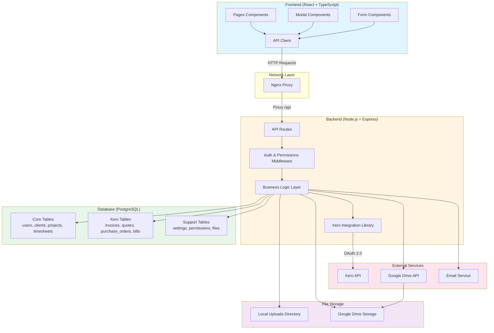

# AmpedFieldOps Architecture Diagrams

This document contains comprehensive visual diagrams showing the data relationships, page hierarchy, and input flows for the AmpedFieldOps application.

---

## 1. High-Level System Architecture

This diagram shows the overall system structure and data flow between components.



**Key Components:**
- **Frontend**: React components (pages, modals, forms) communicate through a centralized API client
- **Network**: Nginx acts as a reverse proxy routing `/api` requests to the backend
- **Backend**: Express routes with middleware for authentication and permissions
- **Database**: PostgreSQL with core business tables, Xero sync tables, and supporting tables
- **External**: Xero API for accounting, Google Drive for backups, email service for notifications

---

## 2. Database Entity Relationship Diagram

This diagram shows all database tables and their relationships.


**Key Relationships:**
- **Users** manage the system and create timesheets
- **Clients** have multiple projects and can be suppliers for purchase orders/bills
- **Projects** are the central entity linking clients, timesheets, cost centers, and financial documents
- **Cost Centers** track budgets and are linked to projects via junction table
- **Xero Entities** sync with Xero API and link back to local clients/projects
- **Financial Flow**: Purchase Orders → Bills → Payments → Bank Transactions (reconciliation)

---

## 3. Backend API Routes Structure

This diagram shows the backend API route organization and HTTP methods.


**Route Organization:**
- **Auth Routes**: Authentication and user session management
- **CRUD Routes**: Standard REST operations for users, clients, projects, timesheets, etc.
- **Xero Routes**: Extensive integration with Xero API (contacts, invoices, purchase orders, bills, expenses, payments, reports)
- **File Management**: Upload, download, and organization of project files and timesheet images
- **Settings & Configuration**: System settings, permissions, role management
- **Dashboard & Reports**: Aggregated data and analytics
- **Safety Documents**: JSA, compliance certificates, safety documents with PDF generation

---

## 4. Frontend Page Hierarchy

This diagram shows the frontend page structure, routing, and component relationships.

```mermaid
graph TB
    subgraph PublicRoutes["Public Routes"]
        Login[Login Page]
        ForgotPassword[Forgot Password Page]
    end
    
    subgraph ProtectedRoutes["Protected Routes (DashboardLayout)"]
        Dashboard[Dashboard Page]
        
        subgraph CorePages["Core Pages"]
            Projects[Projects Page]
            Clients[Clients Page]
            Timesheets[Timesheets Page]
            Reports[Reports Page]
        end
        
        subgraph FinancialPages["Financial Pages<br/>(can_view_financials)"]
            Financials[Financials Page]
            FinancialsInvoices[Invoices Tab]
            FinancialsQuotes[Quotes Tab]
            FinancialsPayments[Payments Tab]
            FinancialsPurchaseOrders[Purchase Orders Tab]
            FinancialsBills[Bills Tab]
            FinancialsExpenses[Expenses Tab]
            FinancialsCreditNotes[Credit Notes Tab]
            FinancialsReports[Financial Reports Tab]
        end
        
        subgraph AdminPages["Admin Pages<br/>(can_manage_users)"]
            Users[Users Page]
            Troubleshooter[Troubleshooter Page]
            Backups[Backups Page]
        end
        
        subgraph ConfigPages["Configuration Pages"]
            ActivityTypes[Activity Types Page<br/>(can_edit_activity_types)]
            Settings[Settings Page]
            UserSettings[User Settings Page]
        end
        
        subgraph FilePages["File Pages<br/>(can_view_financials)"]
            Files[Files Page]
            SafetyDocuments[Safety Documents Page]
        end
    end
    
    subgraph Modals["Modal Components"]
        ProjectDetailModal[Project Detail Modal]
        ClientDetailModal[Client Detail Modal]
        PaymentModal[Payment Modal]
        PurchaseOrderModal[Purchase Order Modal]
        BillModal[Bill Modal]
        ExpenseModal[Expense Modal]
        MobileTimesheetModal[Mobile Timesheet Modal]
        ImageViewer[Image Viewer Modal]
        NotificationsPanel[Notifications Panel]
        ErrorLogPanel[Error Log Panel]
    end
    
    subgraph SharedComponents["Shared Components"]
        Header[Header Component]
        Sidebar[Sidebar Component]
        DashboardLayout[Dashboard Layout]
    end
    
    Login -->|Authenticate| Dashboard
    ForgotPassword -->|Reset| Login
    
    DashboardLayout --> Header
    DashboardLayout --> Sidebar
    DashboardLayout --> Dashboard
    DashboardLayout --> CorePages
    DashboardLayout --> FinancialPages
    DashboardLayout --> AdminPages
    DashboardLayout --> ConfigPages
    DashboardLayout --> FilePages
    
    Projects --> ProjectDetailModal
    Clients --> ClientDetailModal
    Financials --> FinancialsInvoices
    Financials --> FinancialsQuotes
    Financials --> FinancialsPayments
    Financials --> FinancialsPurchaseOrders
    Financials --> FinancialsBills
    Financials --> FinancialsExpenses
    Financials --> FinancialsCreditNotes
    Financials --> FinancialsReports
    Financials --> PaymentModal
    Financials --> PurchaseOrderModal
    Financials --> BillModal
    Financials --> ExpenseModal
    Timesheets --> MobileTimesheetModal
    Timesheets --> ImageViewer
    Header --> NotificationsPanel
    Header --> ErrorLogPanel
    
    style PublicRoutes fill:#ffebee
    style ProtectedRoutes fill:#e8f5e9
    style CorePages fill:#e3f2fd
    style FinancialPages fill:#fff3e0
    style AdminPages fill:#f3e5f5
    style ConfigPages fill:#eceff1
    style FilePages fill:#fff9c4
    style Modals fill:#fce4ec
    style SharedComponents fill:#e0f2f1
```

**Page Structure:**
- **Public Routes**: Login and password recovery (no authentication required)
- **Protected Routes**: All main application pages require authentication
- **Permission-Based Access**: Financial pages, admin pages, and configuration pages require specific permissions
- **Modal Components**: Reusable modals for detailed views and forms
- **Shared Layout**: DashboardLayout provides consistent header and sidebar navigation

---

## 5. Form Inputs and Data Mapping

This section shows how user inputs in forms map to API endpoints and database tables.

### 5.1 Project Creation Form


**Project Form Mapping:**
- **Code**: Unique project identifier → `projects.code` (VARCHAR(50) UNIQUE)
- **Name**: Project name → `projects.name` (VARCHAR(255))
- **Client**: Selected client → `projects.client_id` (UUID FK to clients)
- **Status**: Project status → `projects.status` (ENUM: quoted, in-progress, completed, invoiced)
- **Budget**: Budget amount → `projects.budget` (DECIMAL(15,2))
- **Description**: Project description → `projects.description` (TEXT)
- **Dates**: Start/end dates → `projects.start_date`, `projects.end_date` (DATE)
- **Cost Centers**: Multiple selection → `project_cost_centers` junction table

### 5.2 Client Creation Form


**Client Form Mapping:**
- **Name**: Client name → `clients.name` (VARCHAR(255))
- **Contact**: Contact person → `clients.contact_name` (VARCHAR(255))
- **Email**: Primary email → `clients.email` (VARCHAR(255))
- **Phone**: Phone number → `clients.phone` (VARCHAR(50))
- **Address**: Physical address → `clients.address` (TEXT)
- **Location**: Location string → `clients.location` (VARCHAR(255))
- **Billing**: Billing address/email → `clients.billing_address`, `clients.billing_email`
- **Notes**: Additional notes → `clients.notes` (TEXT)

### 5.3 Timesheet Entry Form


**Timesheet Form Mapping:**
- **Project**: Selected project → `timesheets.project_id` (UUID FK)
- **Activity Type**: Work type → `timesheets.activity_type_id` (UUID FK)
- **Cost Center**: Budget allocation → `timesheets.cost_center_id` (UUID FK)
- **Date**: Work date → `timesheets.date` (DATE)
- **Hours**: Hours worked → `timesheets.hours` (DECIMAL(5,2))
- **Notes**: Work description → `timesheets.notes` (TEXT)
- **Location**: Work location → `timesheets.location` (VARCHAR(255))
- **Images**: Photo uploads → `timesheets.image_urls` (TEXT[]) + file storage

### 5.4 Purchase Order Creation Form


**Purchase Order Form Mapping:**
- **Supplier**: Client as supplier → `xero_purchase_orders.supplier_id` (UUID FK to clients)
- **Project**: Linked project → `xero_purchase_orders.project_id` (UUID FK, nullable)
- **Dates**: PO date and delivery → `xero_purchase_orders.date`, `delivery_date` (DATE)
- **Line Items**: Array of items → `xero_purchase_order_line_items` table with:
  - Description, quantity, unit_amount, line_amount
  - Account code, cost_center_id, item_id
- **Notes**: Additional notes → `xero_purchase_orders.notes` (TEXT)
- **Currency**: Currency code → `xero_purchase_orders.currency` (VARCHAR(10))

### 5.5 Bill Creation Form


**Bill Form Mapping:**
- **Supplier**: Bill supplier → `xero_bills.supplier_id` (UUID FK)
- **Purchase Order**: Optional linked PO → `xero_bills.purchase_order_id` (UUID FK, nullable)
- **Project**: Linked project → `xero_bills.project_id` (UUID FK, nullable)
- **Dates**: Bill date and due date → `xero_bills.date`, `due_date` (DATE)
- **Line Items**: Bill items → `xero_bills.line_items` (JSONB)
- **Reference**: Reference number → Stored in line_items or separate field
- **Currency**: Currency code → `xero_bills.currency` (VARCHAR(10))

### 5.6 Expense Creation Form


**Expense Form Mapping:**
- **Project**: Optional project link → `xero_expenses.project_id` (UUID FK, nullable)
- **Cost Center**: Optional cost center → `xero_expenses.cost_center_id` (UUID FK, nullable)
- **Amount**: Expense amount → `xero_expenses.amount` (DECIMAL(15,2))
- **Date**: Expense date → `xero_expenses.date` (DATE)
- **Description**: Expense description → `xero_expenses.description` (TEXT)
- **Receipt**: Receipt image URL → `xero_expenses.receipt_url` (TEXT)
- **Currency**: Currency code → Defaults to USD

---

## 6. User Journey Flows

This section shows key user workflows through the application.

### 6.1 Project Creation to Invoice Generation Flow


**Key Steps:**
1. Create client (if new)
2. Create project linked to client
3. Log multiple timesheet entries for the project
4. Generate invoice from accumulated timesheets
5. Invoice synced to Xero and linked back to timesheets

### 6.2 Purchase Order to Bill to Payment Flow


**Key Steps:**
1. Create purchase order with line items
2. Authorize purchase order
3. Convert authorized PO to bill
4. Record payment against bill
5. Bill status updates to PAID

### 6.3 Client Sync with Xero Flow


**Key Steps:**
1. View local clients
2. Push single client to Xero (creates/updates Xero contact)
3. Store Xero contact ID in local client record
4. Or pull all contacts from Xero (bidirectional sync)

### 6.4 Timesheet Entry with Image Upload Flow


**Key Steps:**
1. User fills timesheet form and selects images
2. Form submitted as FormData (multipart)
3. Backend saves images to file system
4. Image paths stored in `timesheets.image_urls` array
5. Images served via static file route `/uploads/timesheets/...`

### 6.5 Financial Report Generation Flow


**Key Steps:**
1. User navigates to Financial Reports tab
2. Selects report type and date range
3. API calls Xero Reports endpoint
4. Xero returns formatted report data
5. Frontend displays report with charts/tables

---

## Summary

This document provides comprehensive visual documentation of:

1. **System Architecture**: Overall structure showing frontend, backend, database, and external services
2. **Database Schema**: Complete entity relationship diagram with all tables and foreign keys
3. **API Routes**: Organized backend routes grouped by domain with HTTP methods
4. **Frontend Structure**: Page hierarchy, routing, and component relationships
5. **Form Mappings**: Detailed input-to-database mappings for major forms
6. **User Journeys**: Sequence diagrams showing key workflows through the system

These diagrams serve as:
- **Onboarding documentation** for new developers
- **Reference guide** for understanding data flows
- **Architecture documentation** for system design decisions
- **Troubleshooting aid** for tracing data through the system
