# AmpedFieldOps v2 Architecture Comparison

This document compares the original architecture (v1) with the new v2 asynchronous, resilient architecture. It highlights all changes, additions, and improvements made during the system overhaul.

---

## Executive Summary

**v1 Architecture:** Synchronous, blocking Xero API calls that could timeout during long operations.

**v2 Architecture:** Asynchronous, resilient system with worker-queue pattern, cloud storage, and comprehensive audit trails.

---

## 1. High-Level System Architecture Comparison

### v1 Architecture (Before)

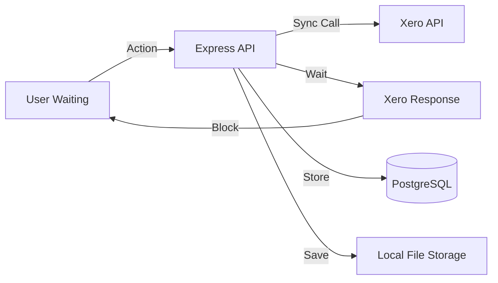

**Characteristics:**
- Synchronous Xero API calls
- User waits for Xero response (potential timeouts)
- Local file storage only
- No audit trail for API calls
- Hard deletes (permanent record removal)

### v2 Architecture (After)

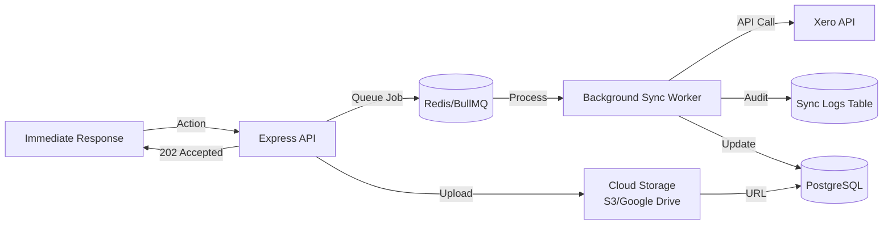

**Key Changes:**
- ✅ Asynchronous job queue (Redis/BullMQ)
- ✅ Background workers for Xero syncs
- ✅ Immediate 202 Accepted responses
- ✅ Cloud storage support (S3/Google Drive)
- ✅ Comprehensive audit trail (sync_logs table)
- ✅ Soft deletes (deleted_at columns)

---

## 2. Database Schema Changes

### New Columns Added

#### Soft Deletes
**Tables Affected:** `clients`, `projects`, `timesheets`, `xero_invoices`, `xero_purchase_orders`, `xero_bills`, `xero_expenses`, `xero_quotes`, `xero_payments`, `xero_credit_notes`

**v1:**
```sql
-- No soft delete support
DELETE FROM clients WHERE id = $1;
```

**v2:**
```sql
-- Soft delete support
ALTER TABLE clients ADD COLUMN deleted_at TIMESTAMP NULL;
-- Records filtered: WHERE deleted_at IS NULL
```

#### Sync Status Tracking
**Tables Affected:** `timesheets`, `xero_invoices`, `xero_purchase_orders`

**v1:**
```sql
-- No sync status tracking
CREATE TABLE xero_invoices (
  ...
  synced_at TIMESTAMP
);
```

**v2:**
```sql
-- Sync status enum and tracking
CREATE TYPE sync_status_enum AS ENUM ('pending', 'synced', 'failed');
ALTER TABLE xero_invoices 
  ADD COLUMN sync_status sync_status_enum DEFAULT 'pending',
  ADD COLUMN xero_sync_id UUID NULL;
```

#### Cloud Storage
**Tables Affected:** `timesheets`

**v1:**
```sql
CREATE TABLE timesheets (
  ...
  image_urls TEXT[]  -- Local paths only
);
```

**v2:**
```sql
CREATE TABLE timesheets (
  ...
  image_urls TEXT[],           -- Backward compatible (local paths)
  cloud_image_urls TEXT[]       -- NEW: Cloud storage URLs
);
```

### New Tables

#### sync_logs Table
**Purpose:** Comprehensive audit trail for all Xero API calls

**v1:** No audit trail table

**v2:**
```sql
CREATE TABLE sync_logs (
  id UUID PRIMARY KEY,
  entity_type VARCHAR(50) NOT NULL,
  entity_id UUID NOT NULL,
  request_payload JSONB,
  response_payload JSONB,
  status_code INTEGER,
  error_message TEXT,
  created_at TIMESTAMP DEFAULT CURRENT_TIMESTAMP
);
```

**Benefits:**
- Track every Xero API call (success or failure)
- Debug sync issues with full request/response data
- Monitor API health and error rates
- Compliance and audit requirements

---

## 3. Backend Architecture Changes

### v1: Synchronous Route Handlers

**Example: POST /api/xero/invoices/from-timesheets**

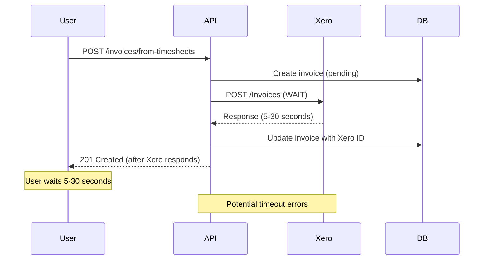

**Issues:**
- User waits for Xero API response
- Timeout errors on slow connections
- No retry mechanism
- No audit trail

### v2: Asynchronous Route Handlers

**Example: POST /api/xero/invoices/from-timesheets**

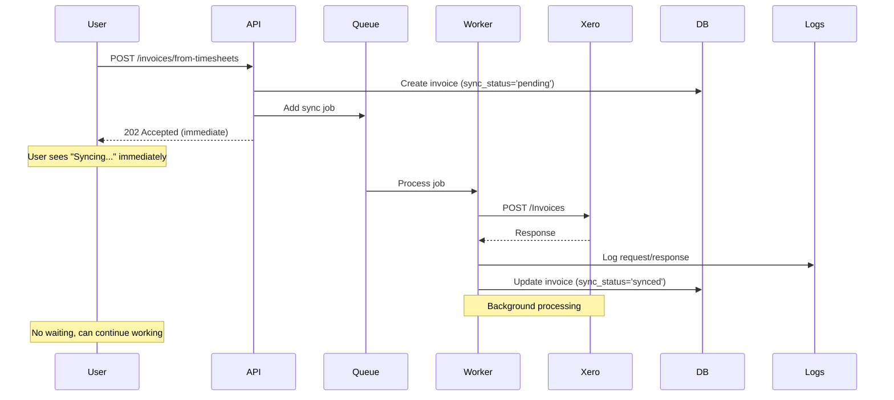

**Benefits:**
- ✅ Immediate response (202 Accepted)
- ✅ No timeouts for users
- ✅ Automatic retries (3 attempts with exponential backoff)
- ✅ Full audit trail in sync_logs
- ✅ Resilient to Xero API issues

### New Infrastructure Components

#### 1. Queue System (BullMQ)
**File:** `backend/src/lib/queue.ts`

**v1:** No queue system

**v2:**
- Redis-based job queue
- Automatic retry logic
- Job cleanup (completed: 24h, failed: 7 days)
- Rate limiting (10 jobs/second)
- Concurrency control (5 concurrent jobs)

#### 2. Background Worker
**File:** `backend/src/lib/queue.ts` (xeroSyncWorker)

**v1:** No background workers

**v2:**
- Processes `sync_invoice_from_timesheets` jobs
- Processes `sync_purchase_order` jobs
- Logs all operations to sync_logs
- Updates entity sync_status
- Handles errors gracefully

#### 3. Cloud Storage Service
**File:** `backend/src/lib/cloudStorage.ts`

**v1:** Local file storage only

**v2:**
- Unified interface for S3, Google Drive, or local storage
- Automatic file upload to cloud
- Public/signed URL generation
- Backward compatible with local paths

#### 4. Audit Trail Wrapper
**File:** `backend/src/lib/xero/auditTrail.ts`

**v1:** No audit trail

**v2:**
- `withAuditTrail()` wrapper function
- Logs all Xero API calls
- Captures request/response payloads
- Records status codes and errors

#### 5. Shared Xero Auth Module
**File:** `backend/src/lib/xero/auth.ts`

**v1:** Auth logic duplicated in routes

**v2:**
- Centralized `getValidAccessToken()` function
- Shared `getXeroCredentials()` function
- Prevents circular dependencies
- Reusable across routes and workers

#### 6. Soft Delete Middleware
**File:** `backend/src/middleware/softDelete.ts`

**v1:** No soft delete support

**v2:**
- Helper functions for soft delete filters
- Automatic exclusion of deleted records
- GET routes filter `WHERE deleted_at IS NULL`

---

## 4. API Route Changes

### Modified Routes

#### POST /api/xero/invoices/from-timesheets

**v1 Response:**
```json
{
  "id": "...",
  "invoice_number": "INV-00001",
  "status": 201,
  "timesheets_count": 5
}
```
- Status: `201 Created`
- Blocks until Xero sync completes
- Potential timeout errors

**v2 Response:**
```json
{
  "id": "...",
  "invoice_number": "INV-00001",
  "sync_status": "pending",
  "timesheets_count": 5,
  "message": "Invoice created. Syncing to Xero in the background...",
  "status": 202
}
```
- Status: `202 Accepted`
- Returns immediately
- Sync happens in background
- Frontend polls for status updates

#### POST /api/xero/purchase-orders

**v1 Response:**
```json
{
  "id": "...",
  "po_number": "PO-00001",
  "status": 201
}
```
- Status: `201 Created`
- Blocks until Xero sync completes

**v2 Response:**
```json
{
  "id": "...",
  "po_number": "PO-00001",
  "sync_status": "pending",
  "message": "Purchase order created. Syncing to Xero in the background...",
  "status": 202
}
```
- Status: `202 Accepted`
- Returns immediately
- Background sync

### New Routes

#### GET /api/xero/invoices/:id/sync-status
**Purpose:** Check sync status of an invoice

**Response:**
```json
{
  "sync_status": "pending" | "synced" | "failed",
  "xero_sync_id": "uuid"
}
```

#### GET /api/xero/purchase-orders/:id/sync-status
**Purpose:** Check sync status of a purchase order

**Response:**
```json
{
  "sync_status": "pending" | "synced" | "failed",
  "xero_sync_id": "uuid"
}
```

#### GET /api/xero/sync-logs
**Purpose:** Retrieve audit trail for an entity

**Query Parameters:**
- `entity_type`: 'invoice' | 'purchase_order' | 'timesheet'
- `entity_id`: UUID of the entity

**Response:**
```json
[
  {
    "id": "...",
    "entity_type": "invoice",
    "entity_id": "...",
    "request_payload": {...},
    "response_payload": {...},
    "status_code": 200,
    "error_message": null,
    "created_at": "2024-01-01T00:00:00Z"
  }
]
```

---

## 5. Frontend Changes

### New UI Components

#### 1. Sync Status Badges
**Location:** `src/components/pages/Financials.tsx`

**v1:** No sync status indication

**v2:**
- "Syncing..." badge with spinner (when sync in progress)
- "Pending Sync" badge (when queued)
- "Synced" badge with checkmark (when complete)
- "Sync Failed" badge (when error occurs)

#### 2. Error Details Modal
**Location:** `src/components/pages/Financials.tsx`

**v1:** No error details view

**v2:**
- "View Error Details" button for failed syncs
- Modal displays:
  - Status code
  - Error message
  - Request payload (JSON)
  - Response payload (JSON)
  - Timestamp

#### 3. Optimistic UI Updates
**Location:** `src/components/pages/Financials.tsx`

**v1:** 
- User clicks "Create Invoice"
- Screen locks waiting for response
- No feedback during sync

**v2:**
- User clicks "Create Invoice"
- Immediate "Syncing..." spinner appears
- Background polling checks sync status every 5 seconds
- Status updates automatically
- User can continue working

### Updated API Client
**File:** `src/lib/api.ts`

**New Methods:**
- `getSyncLogs(entityType, entityId)` - Fetch error details
- `getInvoiceSyncStatus(invoiceId)` - Check invoice sync status
- `getPOSyncStatus(poId)` - Check PO sync status

**Modified Methods:**
- `createInvoiceFromTimesheets()` - Now handles 202 Accepted
- `createPurchaseOrder()` - Now handles 202 Accepted

---

## 6. Infrastructure Changes

### Docker Compose

**v1:**
```yaml
services:
  postgres: ...
  backend: ...
  frontend: ...
  adminer: ...
```

**v2:**
```yaml
services:
  postgres: ...
  redis:                    # NEW
    image: redis:7-alpine
    ports:
      - "6379:6379"
  backend:
    depends_on:
      - postgres
      - redis              # NEW dependency
    environment:
      REDIS_HOST: redis   # NEW
      REDIS_PORT: 6379    # NEW
  frontend: ...
  adminer: ...
```

### Environment Variables

**v1:**
```env
DATABASE_URL=...
JWT_SECRET=...
XERO_CLIENT_ID=...
XERO_CLIENT_SECRET=...
```

**v2:**
```env
# Existing variables...
REDIS_HOST=localhost          # NEW
REDIS_PORT=6379               # NEW
REDIS_PASSWORD=               # NEW (optional)

# Cloud Storage (NEW)
CLOUD_STORAGE_PROVIDER=local  # or 's3' or 'google-drive'

# S3 Configuration (NEW, optional)
AWS_S3_BUCKET=
AWS_REGION=us-east-1
AWS_ACCESS_KEY_ID=
AWS_SECRET_ACCESS_KEY=
```

### Dependencies

**v1:**
```json
{
  "dependencies": {
    "express": "^4.19.2",
    "pg": "^8.12.0",
    "xero-node": "^5.1.0"
  }
}
```

**v2:**
```json
{
  "dependencies": {
    "express": "^4.19.2",
    "pg": "^8.12.0",
    "xero-node": "^5.1.0",
    "bullmq": "^5.0.0",              // NEW
    "ioredis": "^5.3.2",              // NEW
    "@aws-sdk/client-s3": "^3.0.0",   // NEW
    "@aws-sdk/s3-request-presigner": "^3.0.0"  // NEW
  }
}
```

---

## 7. Data Flow Comparison

### Invoice Creation from Timesheets

#### v1 Flow (Synchronous)
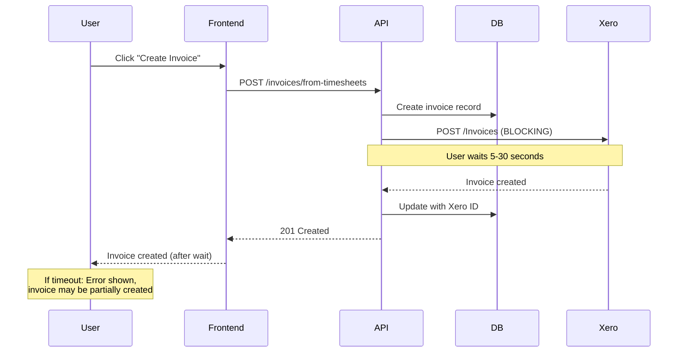

#### v2 Flow (Asynchronous)
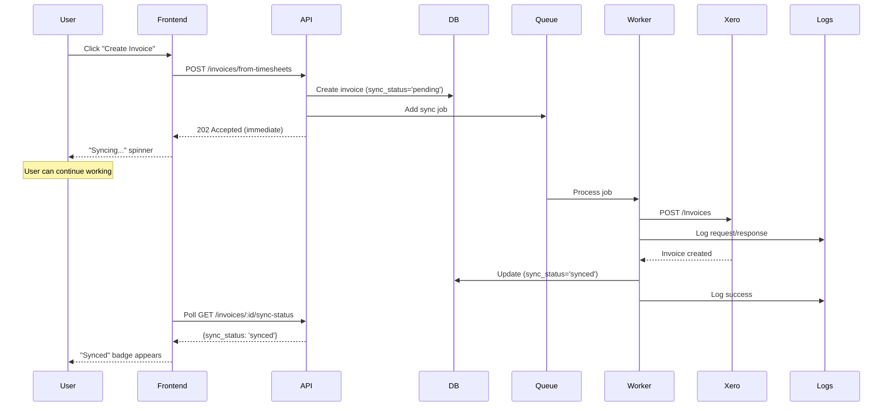

### Purchase Order Creation

#### v1 Flow
- User creates PO → API calls Xero → Waits → Returns result
- **Issue:** Timeout if Xero is slow

#### v2 Flow
- User creates PO → API queues job → Returns 202 → Worker syncs in background
- **Benefit:** No timeouts, user continues working

---

## 8. Error Handling Comparison

### v1 Error Handling

**Scenario:** Xero API timeout during invoice creation

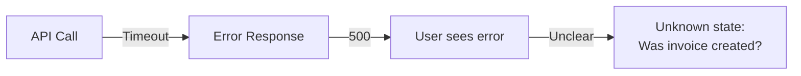

**Issues:**
- No audit trail
- Unclear if operation succeeded
- No retry mechanism
- User must manually check

### v2 Error Handling

**Scenario:** Xero API timeout during invoice creation

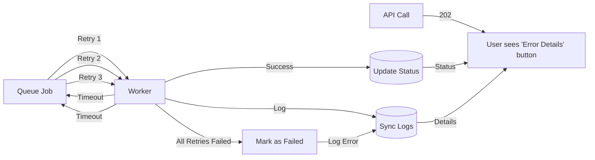

**Benefits:**
- ✅ Automatic retries (3 attempts)
- ✅ Clear error messages
- ✅ Full audit trail
- ✅ User can view error details
- ✅ Can retry failed syncs manually

---

## 9. File Storage Comparison

### v1: Local Storage Only

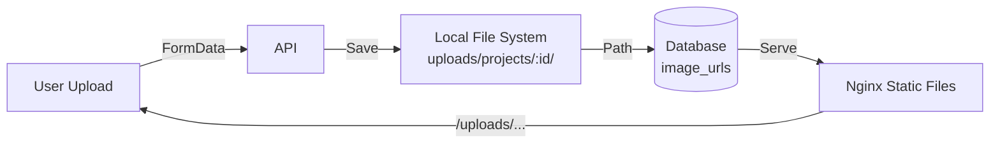

**Limitations:**
- Files tied to server
- No redundancy
- Backup complexity
- Scaling issues

### v2: Cloud Storage Support

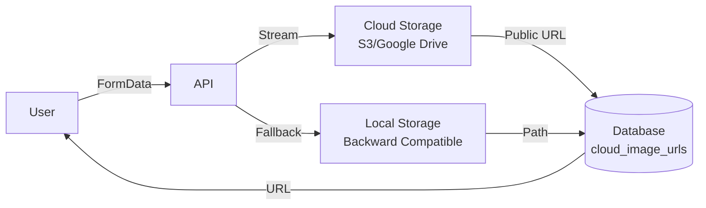

**Benefits:**
- ✅ Scalable storage
- ✅ Redundancy and backups
- ✅ CDN support
- ✅ Backward compatible (local paths still work)

---

## 10. User Experience Comparison

### v1 User Experience

**Creating Invoice from Timesheets:**
1. User clicks "Create Invoice from Timesheets"
2. ⏳ **Screen locks, spinner shows**
3. ⏳ **User waits 5-30 seconds**
4. ✅ Success message OR ❌ Error message
5. If error: No details, unclear what happened

**Issues:**
- Long wait times
- Screen blocking
- No progress indication
- Unclear error states

### v2 User Experience

**Creating Invoice from Timesheets:**
1. User clicks "Create Invoice from Timesheets"
2. ✅ **Immediate "Syncing..." badge appears**
3. ✅ **User can continue working**
4. ✅ **Status updates automatically** (pending → synced)
5. If error: "View Error Details" button with full information

**Benefits:**
- ✅ No waiting
- ✅ Non-blocking UI
- ✅ Real-time status updates
- ✅ Detailed error information

---

## 11. Database Query Changes

### v1: No Soft Delete Filtering

```sql
-- GET /api/clients
SELECT * FROM clients;
-- Returns all clients, including deleted ones
```

### v2: Automatic Soft Delete Filtering

```sql
-- GET /api/clients
SELECT * FROM clients WHERE deleted_at IS NULL;
-- Automatically excludes soft-deleted records
```

**Applied to:**
- All GET routes for: clients, projects, timesheets, invoices, purchase orders, bills, expenses, quotes, payments, credit notes

---

## 12. Monitoring and Observability

### v1: Limited Visibility

- No sync status tracking
- No audit trail
- Errors logged to console only
- No retry visibility

### v2: Comprehensive Monitoring

**New Capabilities:**
- ✅ Sync status per entity (pending/synced/failed)
- ✅ Complete audit trail (sync_logs table)
- ✅ Error details with request/response payloads
- ✅ Retry tracking (job attempts visible)
- ✅ Queue metrics (BullMQ dashboard compatible)

**Query Examples:**
```sql
-- Find all failed syncs
SELECT * FROM sync_logs 
WHERE status_code >= 400 
ORDER BY created_at DESC;

-- Check sync status of invoice
SELECT sync_status, xero_sync_id 
FROM xero_invoices 
WHERE id = '...';

-- View error details
SELECT * FROM sync_logs 
WHERE entity_type = 'invoice' 
  AND entity_id = '...'
ORDER BY created_at DESC;
```

---

## 13. Migration Path

### For Existing Installations

**Step 1: Run Migrations**
```bash
cd backend
npm run migrate
```

This will:
- Add `deleted_at` columns (nullable, no data loss)
- Add `sync_status` and `xero_sync_id` columns (defaults to 'pending')
- Create `sync_logs` table
- Add `cloud_image_urls` column to timesheets

**Step 2: Install Dependencies**
```bash
npm install
```

**Step 3: Start Redis**
```bash
docker-compose up -d redis
# Or: redis-server
```

**Step 4: Update Environment**
```env
REDIS_HOST=localhost
REDIS_PORT=6379
```

**Step 5: Restart Backend**
```bash
pm2 restart ampedfieldops-api
# Or: docker-compose restart backend
```

### Backward Compatibility

**v2 maintains full backward compatibility:**
- ✅ Existing local file paths still work
- ✅ Old API responses still valid
- ✅ No breaking changes to frontend
- ✅ Gradual migration to cloud storage

---

## 14. Performance Improvements

### v1 Performance Issues

- **Blocking Operations:** User waits for Xero API (5-30 seconds)
- **Timeout Errors:** Slow Xero responses cause failures
- **No Retry:** Failed operations must be manually retried
- **No Queue:** All operations compete for resources

### v2 Performance Improvements

- ✅ **Non-Blocking:** Users get immediate responses
- ✅ **Resilient:** Automatic retries handle transient failures
- ✅ **Scalable:** Queue system handles high load
- ✅ **Efficient:** Background workers process jobs optimally
- ✅ **Rate Limited:** Respects Xero API rate limits

---

## 15. Summary of Changes

### Database
- ✅ Added `deleted_at` columns (10 tables)
- ✅ Added `sync_status` enum and columns (3 tables)
- ✅ Added `xero_sync_id` columns (3 tables)
- ✅ Created `sync_logs` table (new)
- ✅ Added `cloud_image_urls` column (timesheets)

### Backend
- ✅ Added BullMQ queue system
- ✅ Added Redis infrastructure
- ✅ Created background worker
- ✅ Refactored 2 routes to async (invoices, purchase orders)
- ✅ Added 3 new routes (sync status, sync logs)
- ✅ Created cloud storage service
- ✅ Created audit trail wrapper
- ✅ Created shared auth module
- ✅ Added soft delete middleware

### Frontend
- ✅ Added optimistic UI (sync status badges)
- ✅ Added status polling
- ✅ Added error details modal
- ✅ Updated API client for 202 responses

### Infrastructure
- ✅ Added Redis to docker-compose
- ✅ Updated environment variables
- ✅ Added new npm dependencies

### Files Created
- `backend/src/lib/queue.ts` - Queue and worker
- `backend/src/lib/cloudStorage.ts` - Cloud storage service
- `backend/src/lib/xero/auditTrail.ts` - Audit wrapper
- `backend/src/lib/xero/auth.ts` - Shared auth
- `backend/src/middleware/softDelete.ts` - Soft delete helpers
- `backend/src/db/migrations/add-soft-deletes.sql`
- `backend/src/db/migrations/add-sync-status.sql`
- `backend/src/db/migrations/add-sync-logs.sql`
- `backend/src/db/migrations/add-cloud-storage.sql`

### Files Modified
- `backend/src/routes/xero.ts` - Async routes, new endpoints
- `backend/src/routes/timesheets.ts` - Cloud upload, soft delete filters
- `backend/src/server.ts` - Queue initialization
- `backend/package.json` - New dependencies
- `docker-compose.yml` - Redis service
- `src/components/pages/Financials.tsx` - Optimistic UI, error modal
- `src/lib/api.ts` - 202 handling, new methods

---

## 16. Benefits Summary

### Reliability
- ✅ No more timeout errors for users
- ✅ Automatic retry on failures
- ✅ Resilient to Xero API issues

### User Experience
- ✅ Immediate feedback
- ✅ Non-blocking operations
- ✅ Clear status indicators
- ✅ Detailed error information

### Observability
- ✅ Complete audit trail
- ✅ Sync status tracking
- ✅ Error debugging tools

### Scalability
- ✅ Queue-based processing
- ✅ Cloud storage support
- ✅ Horizontal scaling ready

### Maintainability
- ✅ Centralized auth logic
- ✅ Reusable components
- ✅ Better error handling
- ✅ Comprehensive logging

---

## 17. Architecture Diagram: v2 Complete System

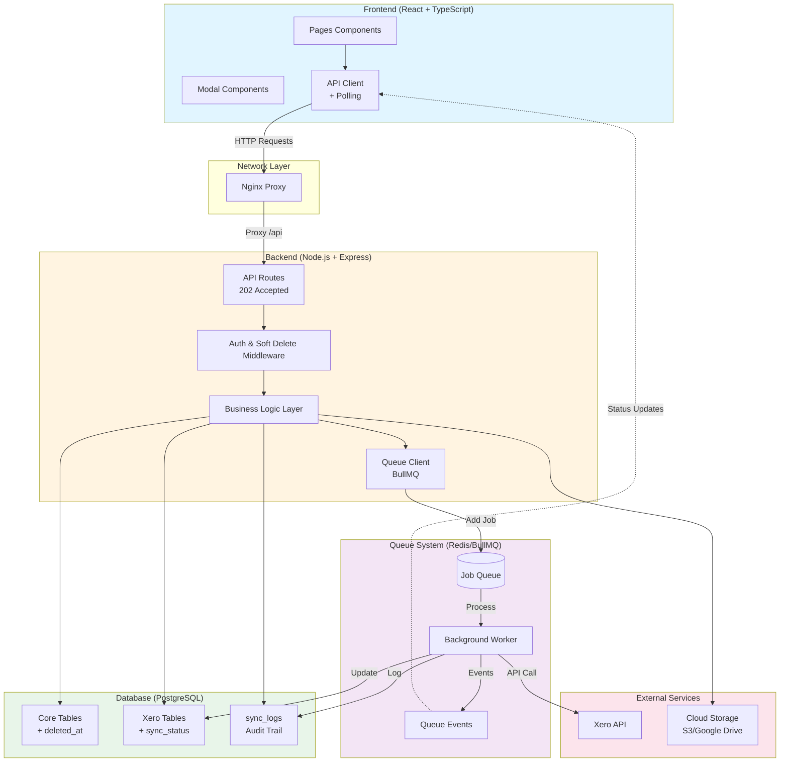

---

## 18. Migration Checklist

### Pre-Migration
- [ ] Backup database
- [ ] Review current Xero sync operations
- [ ] Document any custom modifications

### Migration Steps
- [ ] Pull latest code
- [ ] Install dependencies (`npm install`)
- [ ] Run migrations (`npm run migrate`)
- [ ] Start Redis service
- [ ] Update environment variables
- [ ] Restart backend service
- [ ] Verify queue worker initialized
- [ ] Test invoice creation (should return 202)
- [ ] Verify sync status updates
- [ ] Check sync_logs table for entries

### Post-Migration
- [ ] Monitor queue for any failed jobs
- [ ] Review sync_logs for errors
- [ ] Configure cloud storage (optional)
- [ ] Update frontend if needed
- [ ] Train users on new sync status indicators

---

## 19. Rollback Plan

If issues occur, v2 is designed to be backward compatible:

1. **Queue failures:** App continues to work, syncs just won't process
2. **Redis unavailable:** App starts, syncs show errors but don't crash
3. **Migration issues:** All migrations use `IF NOT EXISTS`, safe to re-run

**To rollback:**
- Stop using new async routes (revert to sync if needed)
- Remove Redis dependency (app works without it)
- Keep using local storage (cloud is optional)

---

## Conclusion

The v2 overhaul transforms AmpedFieldOps from a synchronous, blocking system into an asynchronous, resilient architecture. Key improvements include:

1. **No more timeouts** - Users get immediate responses
2. **Automatic retries** - Failed syncs retry automatically
3. **Full audit trail** - Every API call is logged
4. **Cloud storage** - Scalable file storage
5. **Better UX** - Optimistic UI with status updates
6. **Soft deletes** - Data recovery capability
7. **Error visibility** - Detailed error information for debugging

The system is now production-ready for high-volume operations and provides a much better user experience.
